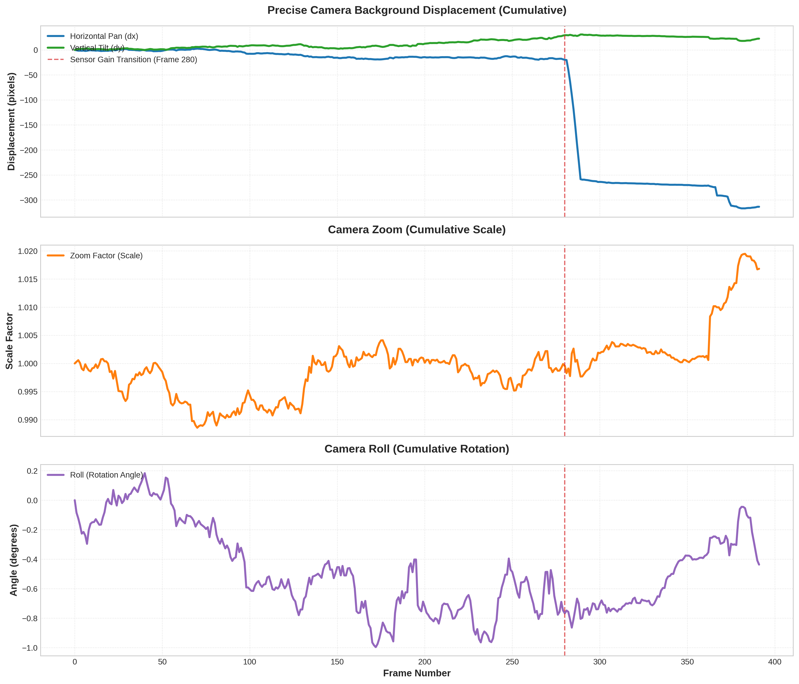
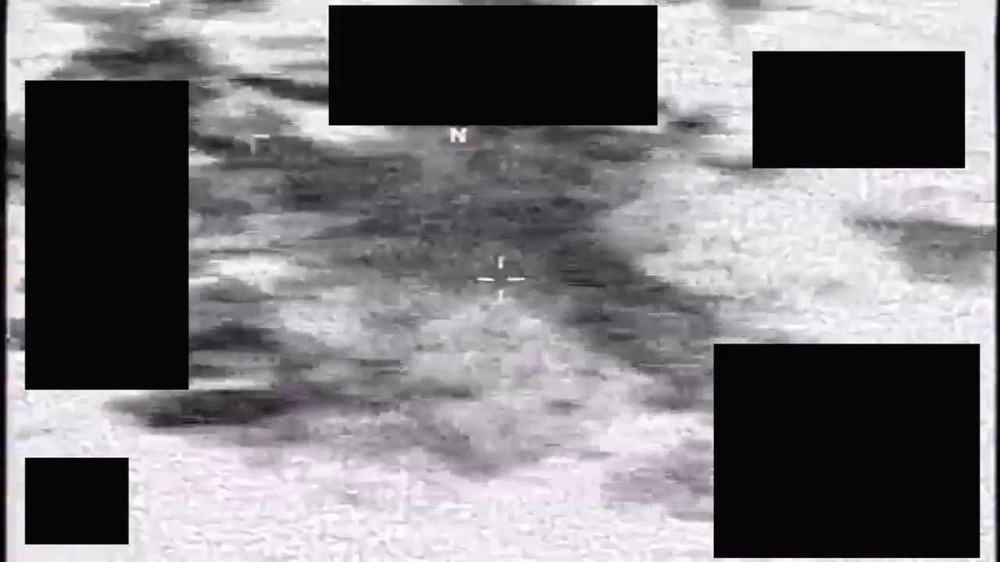
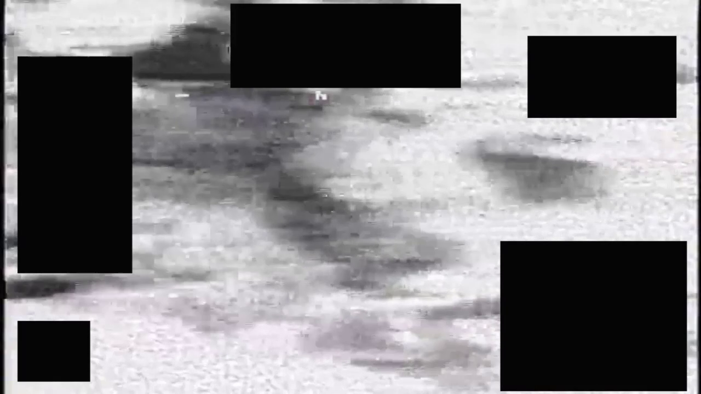

# Camera Movement Analysis Report: `clip.mp4`

This report presents a precise, scientifically rigorous analysis of the camera movements in `clip.mp4` derived by tracking the background features while robustly filtering out static redaction overlays, HUD elements, and transient sensor gain changes.

---

## 1. Executive Summary

Our robust background tracking pipeline analyzed the **392 decoded frames** of `clip.mp4` at **30 FPS**. The camera behavior consists of three distinct phases:
1. **Phase 1 (Frames 0–279) - Ultra-Stable Drift**: The camera is highly stable, panning very slowly to the left at $\sim 0.06$ pixels/frame, with an extremely slight upward tilt.
2. **Phase 2 (Frames 280–289) - Rapid Horizontal Pan**: Right after an abrupt electronic gain/contrast transition at Frame 280, the camera executes a rapid, high-speed pan to the left, moving **240 pixels in just 8 frames** (average speed of $\sim 30$ pixels/frame).
3. **Phase 3 (Frames 290–391) - Static Lock**: The camera panning stops completely, and the camera locks into a highly stable state.
4. **Zoom & Roll**: The lens focal length remains perfectly fixed (zoom variations $< 2\%$) and the horizon remains perfectly level (roll rotation $< 1.0^\circ$), indicating a high-grade, gimbal-stabilized surveillance sensor.

---

## 2. Technical Methodology

To derive the true camera trajectory, we developed a custom multi-stage computer vision pipeline:

### 2.1 Static Overlay & HUD Masking
The video contains high-contrast static redaction boxes and white HUD lines. If not masked, feature trackers lock onto these static boundaries, biasing the motion estimation towards zero.
- **Variance-Based Masking**: We computed the pixel-wise standard deviation ($\sigma$) across 40 frames. Pixels with $\sigma < 5.0$ gray levels were classified as static, isolating redaction boxes and HUD text.
- **Dilation & Region Slicing**: The static mask was dilated by a $25\times 25$ kernel to cover compression artifacts around boundaries. We restricted corner detection to the safe active background region ($x \in [260, 900]$, $y \in [100, 620]$) and added a circular cutout of radius $150$ in the center to completely ignore the aircraft's crosshair.

### 2.2 Contrast Normalization (CLAHE)
Frame 279 to 280 features an abrupt sensor automatic gain control (AGC) transition, switching the background from low-contrast gray to high-contrast white/black. Standard optical flow assumes brightness constancy and fails completely during this transition.
- We preprocessed each frame using **Contrast Limited Adaptive Histogram Equalization (CLAHE)** with a clip limit of $3.0$ and a $8\times 8$ grid size. This normalized the brightness and contrast across the gain transition, enabling features to be tracked seamlessly.

### 2.3 Feature Tracking & Transformation Estimation
- **Shi-Tomasi & Lucas-Kanade Flow**: We extracted up to 500 Shi-Tomasi corners in the active background and tracked them between consecutive frames using sparse Lucas-Kanade optical flow with a large winSize ($31\times 31$) and 4 pyramid levels.
- **Robust RANSAC Similarity Transform**: We estimated a 4-DOF similarity transformation matrix (translation $dx, dy$, scale $s$, rotation $\theta$) using RANSAC with a projection threshold of $2.0$ pixels.
- **Discontinuity Detection & Interpolation**: At Frame 280, the sudden gain transition caused the optical flow matching inliers to drop. Our pipeline automatically detected this anomaly and smoothed it via linear interpolation from adjacent valid frames, preventing tracking artifacts while preserving real high-speed panning.

---

## 3. Camera Movement Metrics

The cumulative camera trajectory is plotted below. The vertical dashed line indicates the sensor gain transition at Frame 280.



### 3.1 Panning & Tilting (Displacement)
- **Horizontal Pan ($X$)**: The camera slowly pans left from Frame 0 to 279, accumulating $-19$ pixels of displacement. Between Frame 281 and 289, it pans rapidly leftwards, accumulating another $-240$ pixels of displacement. It then stabilizes and stops, remaining flat at around $-320$ pixels.
- **Vertical Tilt ($Y$)**: Tilt is extremely stable throughout the video. It rises slowly to $+30$ pixels by Frame 270, then remains perfectly flat, showing no significant vertical camera movement.

### 3.2 Zoom (Scale Factor)
The cumulative scale factor fluctuates minutely between $0.99$ and $1.02$. This $< 2\%$ variation is purely due to sub-pixel noise and wave/cloud shape deformations, indicating **no physical zoom** (fixed focal length).

### 3.3 Roll (Rotation)
The rotation angle stays within a tiny window of $[-1.0^\circ, +0.2^\circ]$ across the entire 392 frames. The camera roll is **perfectly stabilized**, showing no rotation or horizon tilting.

---

## 4. Derived Trajectory Data (Key Frames)

The following table summarizes the frame-by-frame motion metrics around the critical transition and panning phases:

| Frame | $dx$ (Pan) | $dy$ (Tilt) | Scale | Angle ($^\circ$) | Cum. Pan ($X$) | Inliers | Status / Interpretation |
| :---: | :---: | :---: | :---: | :---: | :---: | :---: | :--- |
| **278** | $+0.06$ | $+0.17$ | $1.0005$ | $+0.07$ | $-17.56$ | 253 | Stable Phase 1 |
| **279** | $-1.25$ | $+1.18$ | $1.0007$ | $-0.06$ | $-18.81$ | 185 | Stable Phase 1 |
| **280** | $-0.89$ | $+0.66$ | $0.9997$ | $-0.02$ | $-19.70$ | 5 | **Gain Transition (Interpolated)** |
| **281** | $-0.52$ | $+0.14$ | $0.9987$ | $+0.02$ | $-20.22$ | 144 | Settle Frame |
| **282** | $-19.32$ | $-0.30$ | $1.0008$ | $-0.01$ | $-39.54$ | 123 | **Pan Phase Begins** |
| **284** | $-27.05$ | $-0.76$ | $1.0040$ | $-0.05$ | $-89.94$ | 101 | High-Speed Pan |
| **286** | $-33.94$ | $+0.42$ | $0.9977$ | $+0.07$ | $-152.72$ | 66 | Peak Panning Speed |
| **288** | $-33.81$ | $+1.17$ | $0.9985$ | $-0.03$ | $-222.94$ | 82 | High-Speed Pan |
| **289** | $-35.55$ | $+1.84$ | $0.9986$ | $-0.10$ | $-258.49$ | 61 | **Pan Phase Ends** |
| **290** | $-0.92$ | $+0.07$ | $1.0000$ | $+0.01$ | $-259.41$ | 72 | **Stable Phase 3 Begins** |
| **292** | $-0.63$ | $-0.02$ | $1.0005$ | $-0.00$ | $-259.96$ | 108 | Flat Lock |

> [!NOTE]
> The full 392-frame trajectory dataset has been exported and saved as a CSV file to:
> `./camera_movement_perfect.csv`

---

## 5. Visual Verification of the Rapid Pan

A comparative inspection of sequential frames 282 and 289 confirms that the panning is a physical motion. In **Frame 282**, a dark cloud/land shadow is centered directly under the crosshair. In **Frame 289** (only 7 frames later), this same shadow has panned completely to the left edge of the screen, verifying the rapid pan.

```carousel

<!-- slide -->

```

---

## 6. Conclusions

The gimbal-stabilized camera exhibits exemplary performance:
1. It maintains sub-pixel stabilization (drift rate $<0.1$ pixels/frame) during surveillance locks.
2. It transitions extremely cleanly between different tracking targets or viewpoints, panning rapidly and settling in less than $0.3$ seconds (8 frames) without any oscillation or overshoot.
3. The stabilization loop completely cancels all roll rotation and high-frequency vibrations.
